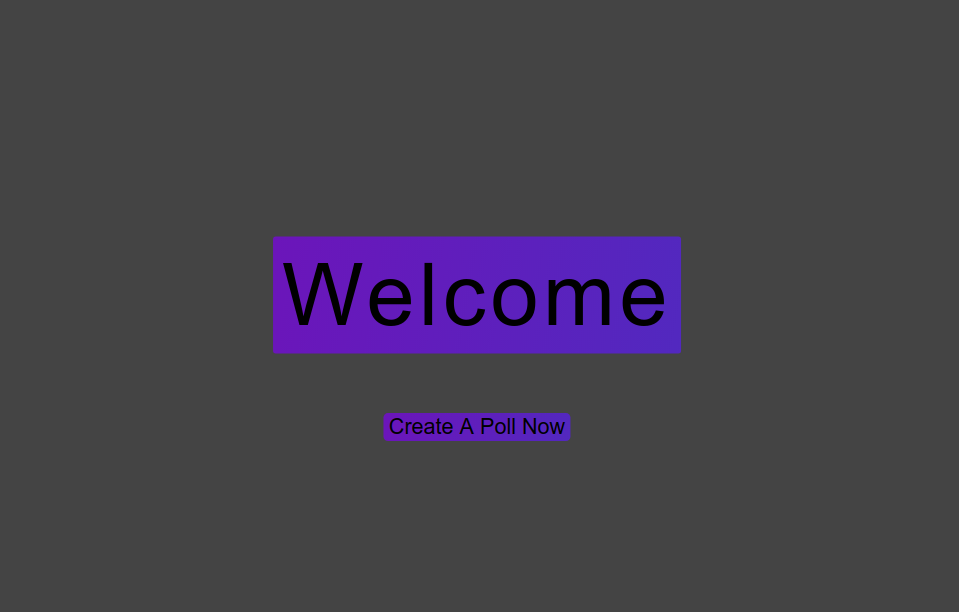
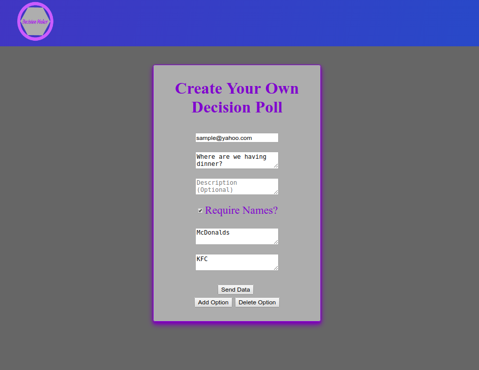
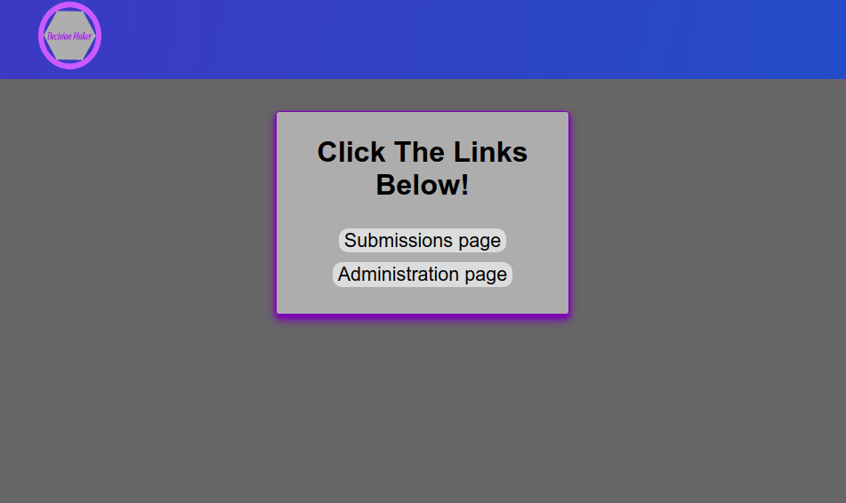
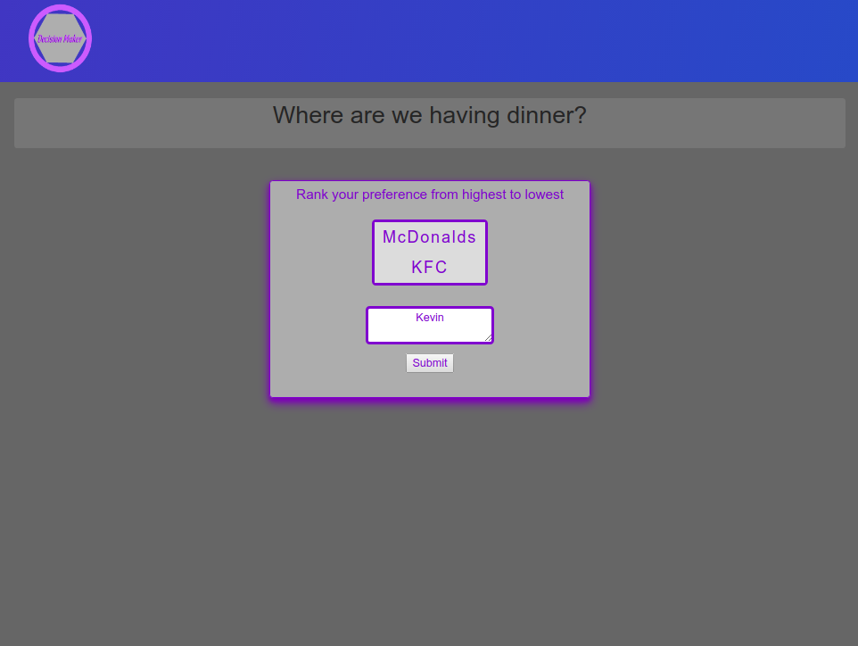
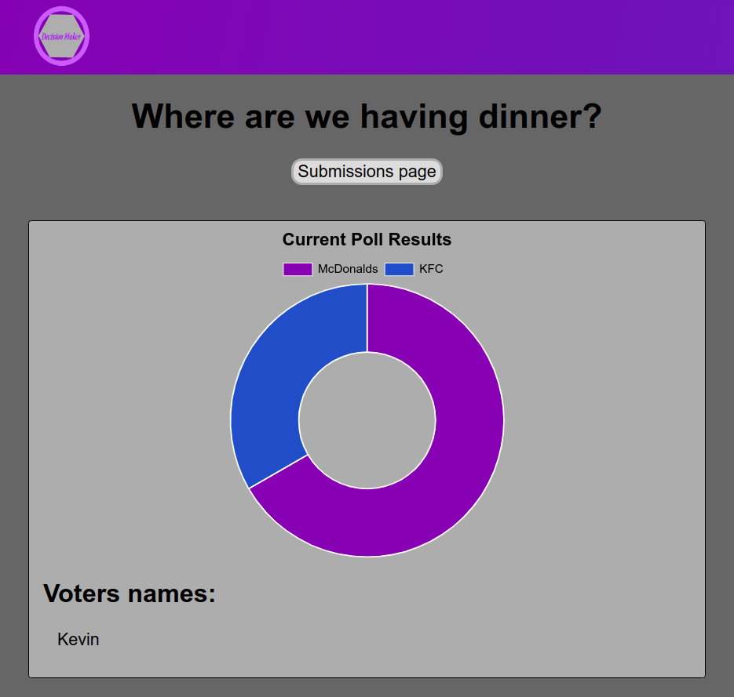

# Mitderm Project: Decision Maker

## Contributors: [Tristan Deering](https://github.com/Noonmoon), [Ashton Hauser](https://github.com/ashtonhauser), and [Ying Dong](https://github.com/dongyingname)

## Description:

This is a web app that allows groups of friends to create a poll of decisions and to vote on their preferred choices.

* Create simple polls quickly and easily. 
* No registration required!
* The creater of the poll will be notified by an email when the poll is created or when a new ranking of decisions takes place.
* Users who have the link to the website can view the poll's result.

## Dependencies

- body-parser,
- chart.js
- dotenv
- ejs
- express,
- knex,
- knex-logger
- morgan
- nodesassmiddleware
- nodemailer
- pg
- sortablejs

## Getting Started

- to install all the dependencies.
```
$npm install 
```
- To run the web server run the following command in terminal:
```
$npm run local 
```
- To view the Decision Maker page go to http://localhost:8080/.

- On poll creation page check the 'Require Names?' if you want your friends to show their names .

- On submission page rank the decisions by drag-and-drop. Click 'submit' to submit your own ranking. A new link will pop up, which directs you to the poll result.

- On administration page/poll result page the ranking is rendered into a pie-chart. All the users' names, if are required by the creator, are displayed in the bottom left corner.

## Final Product







## Contributors' Information
- [Tristan Deering](https://github.com/Noonmoon)
- [Ashton Hauser](https://github.com/ashtonhauser)
- [Ying Dong](https://github.com/dongyingname)

